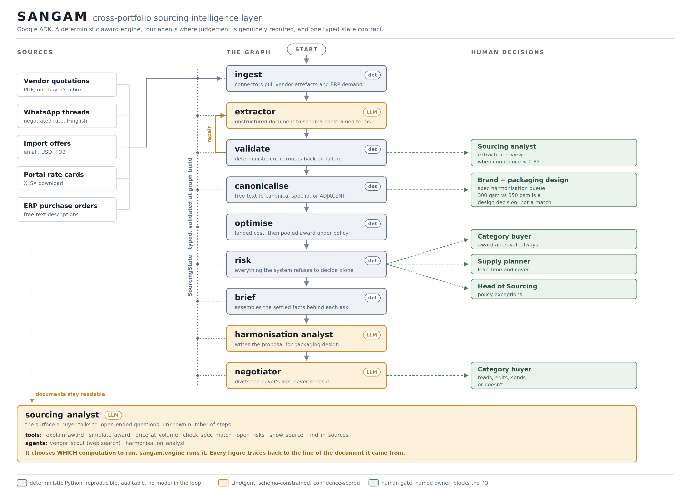

# SANGAM

**A cross-portfolio packaging sourcing intelligence layer, built on Google ADK.**

Reads vendor commercial terms out of whatever form they actually arrive in — PDF
quotations, WhatsApp negotiations, import emails in USD, portal rate cards, ERP
exports — resolves every brand's free-text item description to one canonical
spec, normalises everything to landed cost, and awards pooled volume under a
written sourcing policy.

```bash
python -m venv venv
venv\Scripts\activate
pip install -e ".[dev]"
python -m sangam --date 2026-08-11        # the batch pipeline, offline
python -m sangam --trace                  # every node event as it fires
python -m sangam.demo_tools               # the analyst's tools, without a model
pytest                                    # 106 tests
adk web                                   # talk to the analyst (needs a key)
```

Python 3.10+. No API key needed for any of the above: the extraction stage
replays a verified fixture so runs are byte-reproducible. Set `GOOGLE_API_KEY`
and pass `--live` to run the real agents.
```bash
python -m sangam --live --trace
adk web
```
---

## The problem this solves

A group operating 30+ consumer brands buys packaging separately for each one.
A meaningful share of those brands buy *the same physical object* — a 50 ml
amber bottle, an 18 mm aluminium cap, a 350 gsm kraft carton — from overlapping
vendor pools, at different prices, on different payment terms, at volumes that
individually sit near the bottom of every vendor's price ladder.

The obvious diagnosis is that nobody is bundling volume. That is incomplete,
and it is why the problem survives every spreadsheet pointed at it.

**The actual bottleneck is that the purchasing data has no shared referent.**
Three brands buying the identical bottle describe it as:

```
"Amber glass bottle 50ml 18mm neck"
"50 ml amber bottle, 18 mm, glass"
"AMBER GLASS BTL 50ML NK18"
```

and the vendor's own quotation, sitting in a PDF in one buyer's inbox, calls it
something else again. Until those four strings resolve to one identifier there
is nothing to bundle, nothing to benchmark, and no way to notice that one brand
pays ₹9.20 for what another pays ₹8.90 for.

The commercial terms are not in any system either:

| Where the price actually lives | Format it arrives in |
|---|---|
| Vendor quotation | PDF attached to one buyer's email |
| Negotiated rate | WhatsApp message at 11:40, superseding the 11:09 list rate |
| Rate card | Spreadsheet downloaded from a vendor portal |
| Import offer | Email in USD, FOB, with duty and freight unstated |
| What we actually pay | ERP purchase order lines, free-text descriptions |

Five formats, four languages of commerce (INR and USD, EXW and FOR and FOB,
credit and advance, per-piece and per-container), and one shared property: none
of them is queryable.

### Why a model, rather than a form

The standard fix is a PIM plus a procurement module, and the standard outcome
is that the fields are empty within a quarter. It fails structurally: it asks
30 brand teams to do disciplined data entry in exchange for a benefit that
accrues centrally, later, to someone else.

A language model inverts the cost. Buyers keep negotiating on WhatsApp, vendors
keep sending PDFs, brands keep typing `kraft carton 350gsm matt lam 4c` however
they like, and the system reads what already exists. The organisational change
required is zero, which is the only reason it would still be running in month
six.

### What it finds

On the sample portfolio in `data/` — 5 specs, 7 brands, 4 vendor documents:

| Canonical spec | Brands | Landed ₹/pc | Quarterly saving |
|---|---|---|---|
| Amber glass bottle, 50 ml | 3 | 9.29 → 7.23 (−22.2%) | ₹3,34,054 |
| Aluminium screw cap, 18 mm | 3 | 2.60 → 2.08 (−19.9%) | ₹83,660 |
| Kraft mono carton, 350 gsm | 4 | 6.47 → 4.98 (−23.1%) | ₹5,03,242 |
| PET jar, 200 ml | 3 | 7.17 → 6.32 (−11.9%) | ₹1,68,917 |
| Laminated stand-up pouch, 250 g | 2 | 4.06 → 3.40 (−16.3%) | ₹1,51,177 |
| **Total** | **7** | **19.3% of addressable spend** | **₹12,41,050** |

Three results matter more than the headline.

**The cheap answer loses on the PET jar.** The import source is ₹5.84 landed
against ₹7.03 domestic, a 17% gap. Policy caps import exposure at 60% anyway,
because a 47-day lead time with no domestic fallback is not a saving, it is an
outage waiting on a container delay. The system takes the 11.9% it can defend
rather than the 18% it cannot.

**The binding constraint is data quality, not price.** Three of five specs come
back flagged as a policy exception with no second qualified source — not
because alternatives do not exist, but because one vendor's price lapsed on 31
July and another has been supplying a brand with nothing on file at all.

**Risk flags carry a price tag.** For the carton, re-confirming the lapsed
quote is a computed number: it enables dual-sourcing at ₹52,500 per quarter and
clears a high-severity single-source exposure on ₹16.7 lakh. The buyer sees a
decision with a number attached, not a nag.

---

## Architecture



Two surfaces sit on one deterministic engine.

**The batch pipeline** runs on a schedule and produces the quarterly sourcing
brief. **The sourcing analyst** is what a buyer talks to when the brief
provokes a question. Neither of them does arithmetic — every number in this
system comes out of `sangam.engine`, and there is a test asserting the two
surfaces cannot disagree.

### Where agency earns its keep

The question that shaped this design is not whether to use agents, but which
decisions genuinely require a model and which only look like they do. Five
stages are agentic because the job is open-ended in a way no pipeline captures:

| Agent | Why a model rather than code |
|---|---|
| `extractor` | Reads a Hinglish WhatsApp thread and works out that the 11:40 message supersedes the 11:09 rate, that "1 lakh" is 100,000, and that "50% advance, 50% before dispatch" means the buyer funds the order rather than receiving credit. Runs as a **repair loop** against a deterministic critic. |
| `sourcing_analyst` | Answers questions nobody anticipated by choosing what to compute, reading the result, and often deciding to compute something else. |
| `vendor_scout` | Finding a second source is a web search of unknown length: query, read, discard the trading companies, notice a candidate is in the wrong region for the freight assumption, search again. Returns sourced leads, never qualified vendors, never prices. |
| `harmonisation_analyst` | Whether a brand's carton can move from 300 gsm to 350 gsm depends on the shipper it sits in, the stacking height, and the brand's own view of how the pack should feel. None of that is in the data. |
| `negotiator` | Writes the buyer's ask in the buyer's voice, and calls a pricing tool to verify the volume and price it is about to state are real at that quantity. |

### And where it does not

**The award arithmetic is deterministic, and that is the point rather than a
limitation.** A buyer will be asked in a review why one vendor got 336,000
pieces. *"The model weighed the tradeoffs"* does not survive that question;
*"here is the landed cost of every candidate at that volume, and here is the
policy that bound the split"* does.

Both requirements are met by the same move: **the model decides what to
compute, and deterministic code computes it.** The analyst has full latitude
over which vendor to exclude, which volume to test, how many simulations to run
and in what order. It has none at all over the numbers that come back.

### The extraction repair loop

```
ingest ──► extractor ──► validate ──┬── accept ──► canonicalise ──► …
              ▲                     │
              └──── repair ─────────┘   bounded at 3 attempts
```

An LLM stage that runs once and hands its output downstream is a function call
with a model inside it. What makes this one agentic is that the output is
checked by code that knows what a valid commercial term looks like, and the
model is handed its own failures and asked to fix them.

The critic is deterministic on purpose — a model grading its own extraction
agrees with itself. It rejects:

- a vendor id that is not in the vendor master
- a domestic vendor quoted in USD, or an import lead time that ignores transit
- a price ladder that gets *more* expensive with volume (a misread, not a term)
- a per-piece price implausible for packaging (a units error)
- high confidence on a record whose own evidence admits an assumption
- a citation whose line span does not contain the price it reported
- **terms credited to a vendor who appears nowhere in the cited document**

That last one is the error the structural checks miss, and it came from a live
run: the extractor credited one vendor's quotation to a different vendor. The
record validated perfectly, because the vendor it named was real — it priced
correctly, awarded volume, and reached a negotiation draft addressed to a
company that had never quoted.

The loop is bounded. On exhaustion the run continues with whatever survived and
the failures become review items, because a pipeline that blocks until a model
gets it right is a pipeline that hangs.

### Canonicalisation, the part that is easy to get wrong

Deliberately **not** fuzzy matching and **not** an embedding lookup. Both will
cheerfully tell you a 300 gsm carton is a 350 gsm carton. It parses attributes
and requires agreement on every attribute present on both sides; one
conflicting attribute means *not this spec*, surfaced as ADJACENT for a human.

A system that silently substitutes a near-match does not just make an error, it
**launders a bad decision as an optimised one**, and the error is discovered on
a receiving dock two months later.

Under-specification is treated differently from contradiction. A brand writing
"white" where the spec says "white opaque" has under-described the same item
and still matches; a brand writing "amber" has described a different item and
does not. That distinction is the difference between usable recall and a system
that flags everything.

### Context does not stop at extraction

Structured terms drop everything the document said around them: the revision
clause, the rate that was negotiated down rather than offered, the vendor who
has chased twice. So the raw documents stay reachable. Every quote carries the
document and line span its terms came from, the brief prints that citation on
every awarded price (`terms read from om_print_ratecard.txt:7-15`), and the
analyst can reopen it with `show_source` or search across all of them with
`find_in_sources`.

### Human-in-the-loop, placed where it earns its keep

Approval gates on every action get click-through-approved within a fortnight.
There are four, and each exists because the system genuinely cannot know the
answer:

| Gate | Trigger | Owner |
|---|---|---|
| Extraction review | confidence below 0.85 | Sourcing analyst |
| Spec harmonisation | attribute conflict | Brand + packaging design |
| Award approval | every award, always | Category buyer |
| Policy exception | dual-source impossible | Head of Sourcing |

Note what is *not* gated: the system never contacts a vendor. The negotiator
drafts and stops. An agent that emails vendors autonomously is a reputational
surface with no upside, and the drafting is most of the time saved at none of
the risk.

### Policy is data, not prompt

Every constraint the optimiser respects lives in `data/policy.yaml`, in words a
buyer can argue with. Nothing that shapes an award sits inside an agent
instruction, because a policy you cannot diff is a policy you cannot audit.

Change one line and rerun:

- `max_import_share: 1.0` → the PET jar collapses onto a single 47-day import source, and the resilience premium disappears with it
- `dual_source_threshold_inr: 0` → every spec restructures
- `hitl_confidence_floor: 0.70` → the import cap quote, whose freight the extractor flagged as its own estimate, becomes tradeable

Or change `--date`. Run it in 2030 and every quote has lapsed; the system
returns no award rather than committing on a stale price. There is a test for
that.

### What ADK earns

Three specific things:

**A typed state contract.** `SourcingState` is validated against every node
signature when the graph is built, so a node reading a key nothing writes is a
construction-time error rather than a `KeyError` forty seconds into a run. This
caught a real bug during development.

**Cycles with conditional routing.** The repair loop is a real cycle in the
graph, not a retry wrapper: the validator sets a route and the orchestrator
sends the run back to the model with the critique in state. Worth noting that
the `LoopAgent` most tutorials show is deprecated in ADK 2.6 in favour of
exactly this.

**One graph, two extraction strategies.** The live path binds an `LlmAgent`
constrained by a schema; the offline path binds a node replaying a verified
fixture. Same graph, same downstream nodes, same state keys — which is what
makes the fixture a usable regression baseline rather than a parallel code path
that rots.

What ADK is deliberately **not** doing is deciding anything. `sangam/engine/`
has no ADK import anywhere in it.

---

## Layout

```
src/sangam/
  domain/          models, canonical spec registry, vendor master
  engine/          the deterministic core. no ADK, no model, no I/O
    canonicalize.py  attribute matching, conflict detection
    costing.py       FX, duty, freight, incoterms, payment terms
    bundling.py      pooled award under policy, counterfactuals
    risk.py          the register, every flag with a named owner
  extraction/      the LLM contract, ingestion, validation, the fixture
  agents/          the ADK layer
    tools.py         the engine exposed as agent tools
    analyst.py       the conversational surface, root agent
    scout.py         vendor discovery via web search
    harmoniser.py    spec harmonisation proposals
    extractor.py     the repair loop
    workflow.py      the graph
  reporting/       the sourcing council brief
  cli.py           drives the graph through a real ADK Runner
sangam_agent/      discovery module for `adk web` / `adk run`
data/
  raw/             source documents, unmodified
  extracted/       the verified extraction fixture
  policy.yaml      sourcing policy, edited by the sourcing lead
evals/             106 tests. the canonicaliser negatives are the release gate
docs/              captured runs, diagram sources (architecture, two-surfaces)
```

## Evals

`pytest` runs 106 tests across four suites: the canonicaliser against labelled
cases, the cost model, the bundler under varied policy, and the agentic layer
end to end through a real ADK runner.

**The negatives are the release gate.** Any matcher passes
`"amber glass bottle 50ml"`. The cases that cost money are the near-misses: 300
vs 350 gsm, SBS vs kraft, 18 vs 20 mm neck, clear vs amber.

Three real bugs were found by tests rather than review:

- two false positives on colour, either of which is a five-figure wrong PO
- `resilience_premium` measured against the wrong baseline, producing a
  *negative* premium — the label was lying, because paying less is not a premium
- a retry policy configured against dotted exception paths, which ADK never
  matches, so the backoff was attached and inert

## The intelligence layer, and what it does not do yet

Today the intelligence is inference. Nothing in the system learns: buyer
overrides are measured but not consumed, the confidence floor is a constant
rather than a calibrated threshold, and no model here is fine-tuned. That is
sequencing, not a permanent state, but a first build should not be presented as
a learning system.

Two things are built to compound. The extraction fixture is a fine-tuning
corpus as well as an eval baseline: hand-verified extractions from real vendor
documents in the trade's own shorthand is a training set no general model has
seen, and the harness that regression-tests the pipeline is what would prove a
fine-tuned extractor had not regressed against it. The canonical spec registry
is the intelligence layer proper — every description resolved makes the next
one cheaper.

## Honest status of the model stages

The deterministic engine, the graph, the repair cycle and the tool surface all
run and are covered by tests. The five agents have been executed against a live
model: the repair loop cycles, self-corrects against the deterministic critic,
and the pipeline completes end to end.

`data/extracted/quotes.golden.json` is a hand-authored fixture representing
expected extractor output, not the record of a live run. It passes the same
validator live output must pass, which is what makes it a useful regression
baseline — but extraction accuracy against a labelled sample is unmeasured, and
a live run on a smaller model produces materially different awards.

Model names get retired: the Gemini 2.5 family stopped accepting newly created
keys in mid-2026, before its published shutdown date. That is why the model is
`SANGAM_MODEL` in the environment rather than a string in the source. To see
what your key can reach:

```bash
python -c "from google import genai; c = genai.Client(); [print(m.name) for m in c.models.list()]"
```

A live run makes several model calls and the repair loop can burn three on its
own. Free-tier quota is a few requests per minute and 20 per day per model, so
model-backed nodes retry a 429 with exponential backoff
(`SANGAM_RETRY_ATTEMPTS`, `SANGAM_RETRY_DELAY`).

## Not built

Connectors (Gmail, WhatsApp Business API, ERP), the review UI, auth, durable
retries across process restarts. Those are engineering rather than risk.

The vendors, brands and volumes in `data/` are synthetic but modelled on
realistic Indian packaging economics: Firozabad glass, Vapi and Sivakasi
converters, Guangzhou imports, and the price ladders and MOQs that go with them.

## Licence

MIT.
